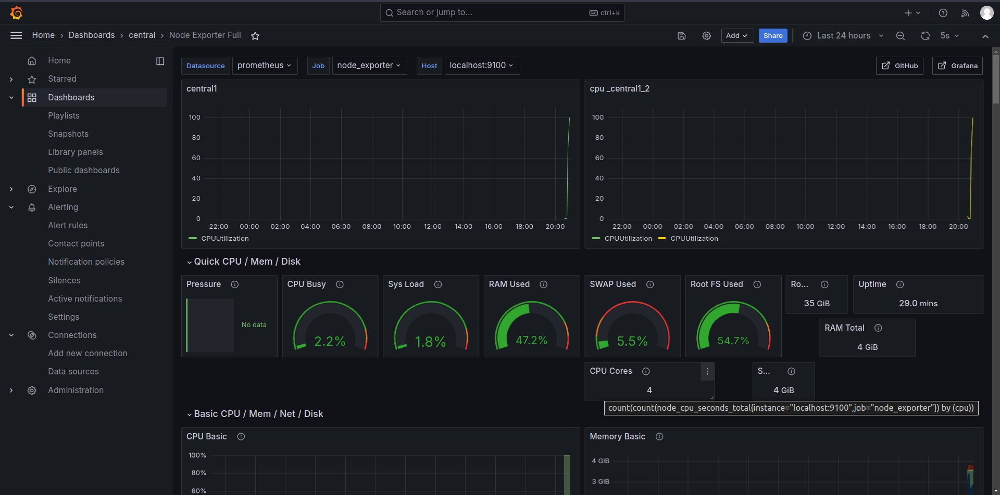
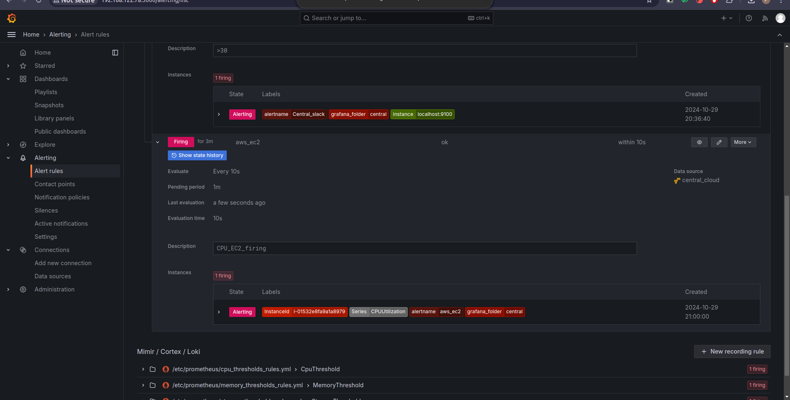
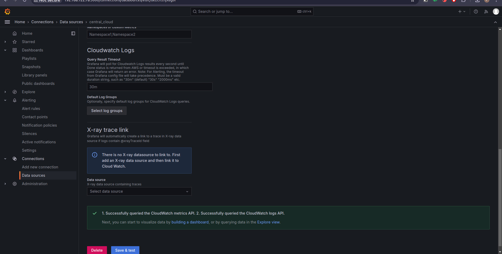
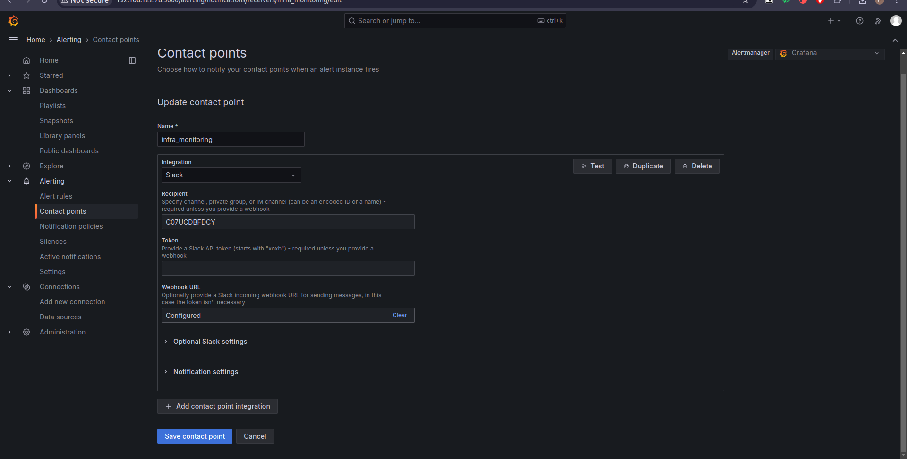
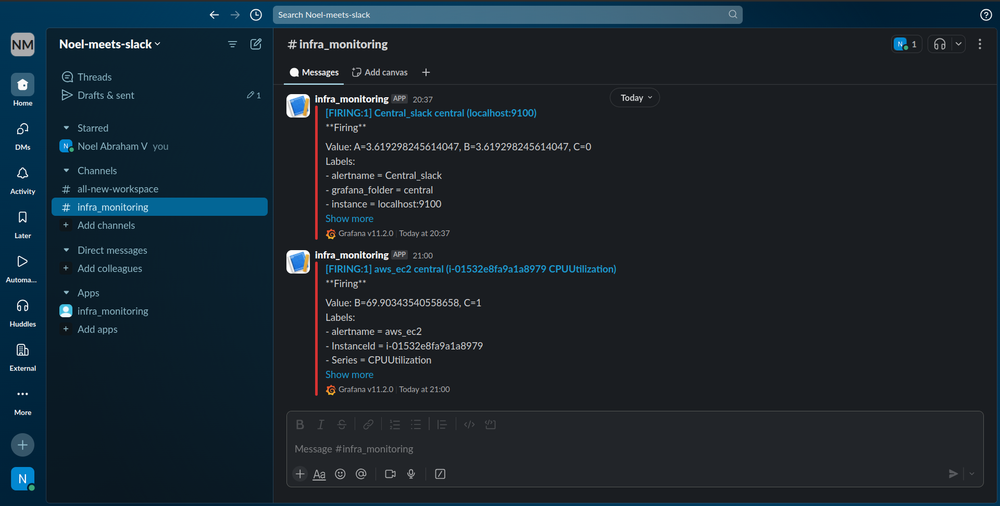

#  Hybrid Infra Monitoring with Alerting

A solution to monitor both on-premise and cloud infrastructure metrics using **Grafana**, **Prometheus**, and **CloudWatch**, with integrated alerting through **Slack**.

## Overview

This project provides centralized monitoring and alerting for a hybrid infrastructure, combining on-prem Linux servers and cloud metrics. Using Grafana, it consolidates data from Prometheus, Loki, and CloudWatch to provide real-time insights and notifications.

### Features
- **Hybrid Monitoring**: Tracks both on-premise server metrics and cloud infrastructure.
- **Alerting Integration**: Configured alerts sent to Slack for proactive response.
- **Modular Setup**: Easily scalable across on-premise and cloud environments.

## Architecture

### Components Used
- **Grafana**: Visualization and alerting tool, integrated with Slack for notifications.
- **Prometheus**: Metrics collection tool for on-premise servers.
- **Promtail** & **Loki**: Log aggregation from on-prem servers.
- **Node Exporter**: Provides detailed hardware and OS metrics from on-prem servers.
- **CloudWatch**: Collects metrics from cloud infrastructure.

### Access Control
- **IAM Role**: Configured to allow Grafana to access CloudWatch metrics.
- **IAM Policies**: Limited permissions provided to access necessary metrics securely.

## Setup and Configuration

1. **On-Premises Setup**  
   - Configure Prometheus, Promtail, and Node Exporter on Linux servers.
   - Set up Loki for log aggregation.

2. **Cloud Integration**  
   - Create and configure an IAM role with the required policies for Grafana access.
   - Connect Grafana to CloudWatch for cloud metrics.

3. **Alerting**  
   - Configure Grafana to send alerts to Slack based on predefined thresholds.

## Screenshots

### Dashboard Overview  

### Alerts  
  

### Data Source Configuration  

### Slack Contact Point Configuration  

### Slack Workspace Integration  

 
---
